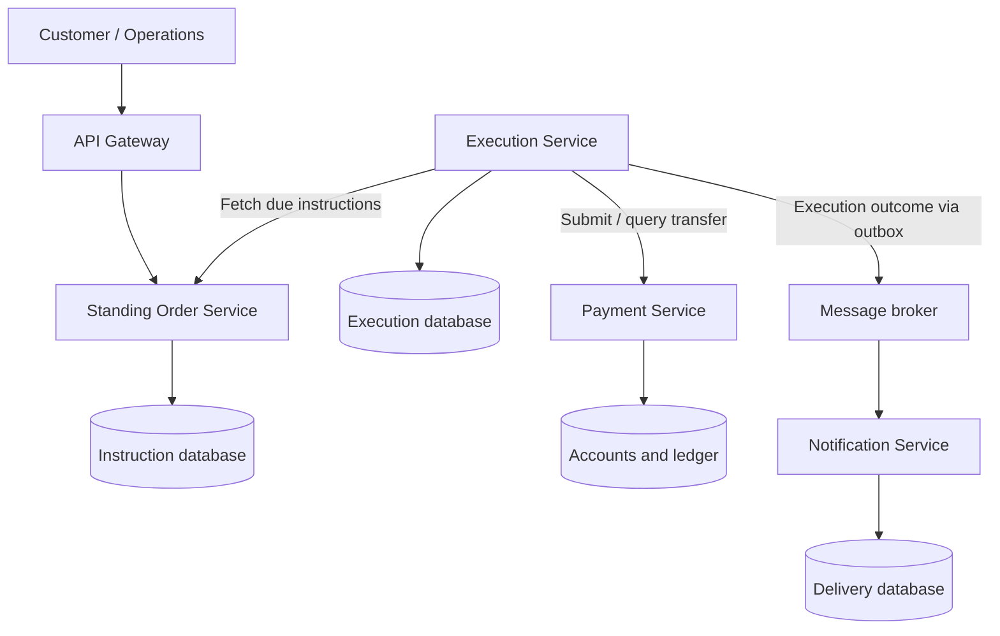

**Case study: EWB Standing Order Processor using microservices**

EWB wants customers to schedule recurring transfers—for example, **₱5,000 from a salary account to a savings account on the 25th of every month**. The system must execute transfers automatically, prevent duplicate payments, handle failures, and maintain an auditable execution history.

Participants must design and build a microservices solution covering secure APIs, role-based access, scheduling, database persistence, resilience, and containerization.

**1. Business scenario**

Maria receives her salary in her EWB account. She creates a standing order with these details:

| Field               | Example         |
| ------------------- | --------------- |
| Source account      | EWB-SAL-1001    |
| Destination account | EWB-SAV-2001    |
| Amount              | ₱5,000          |
| Frequency           | Monthly         |
| Execution day       | 25              |
| Execution time      | 09:00           |
| Time zone           | Asia/Manila     |
| Start date          | 25 October 2026 |
| End date            | Optional        |
| Instruction status  | Active          |

On each scheduled date, EWB validates the instruction and requests the transfer. Maria can view the outcome, pause future transfers, resume the instruction, or cancel it.

**Scope assumption:** The initial implementation supports internal transfers between EWB accounts in the same currency. External payments and foreign exchange are extensions.

**2. Required microservices**

Each service owns its data. Services communicate through APIs or events rather than querying each other’s database tables.

| Component              | Responsibility                                                                         | Owned data                                                     |
| ---------------------- | -------------------------------------------------------------------------------------- | -------------------------------------------------------------- |
| Standing Order Service | Create, view, amend, pause, resume, and cancel instructions                            | Instructions, schedule rules, instruction versions             |
| Execution Service      | Discover due instructions, create execution records, coordinate processing and retries | Executions, attempts, next retry time                          |
| Payment Service        | Validate accounts and funds; perform an internal transfer atomically                   | Accounts, ledger entries, payment results, idempotency records |
| Notification Service   | Send customer updates after processing                                                 | Notification requests and delivery status                      |
| API Gateway            | Route requests and enforce entry-point controls                                        | No business records                                            |
| Identity provider      | Authenticate users and issue access tokens                                             | Users, roles, credentials                                      |

For the lab, the Payment Service acts as a **mock core banking system**. In a real integration, an adapter would call the bank’s core banking platform.



**3. Functional requirements**

| Requirement           | Expected behaviour                                                      |
| --------------------- | ----------------------------------------------------------------------- |
| Create an instruction | Validate amount, schedule, account ownership, and account eligibility   |
| View instructions     | Customers see only their own instructions                               |
| Amend an instruction  | Changes apply to future executions and create a new instruction version |
| Pause or resume       | Paused instructions do not start new transfers                          |
| Cancel                | Stop future executions while retaining history                          |
| Execute automatically | Process due instructions without a user request                         |
| Track outcomes        | Display pending, successful, failed, and unresolved executions          |
| Notify customers      | Send success or failure updates                                         |
| Support investigation | Operations users can inspect attempts, references, and failure reasons  |

**4. End-to-end processing workflow**

1. **Create:** Maria submits an instruction. The Standing Order Service validates it and calculates its next scheduled occurrence.
2. **Discover:** The Execution Service polls for due instructions using paginated requests.
3. **Deduplicate:** It creates one execution record per instruction and scheduled occurrence. A database uniqueness constraint prevents duplicate creation.
4. **Claim:** One worker claims the execution using a lock or time-limited lease.
5. **Revalidate:** The worker checks whether the instruction remains eligible. An agreed execution cut-off determines whether a recent pause or cancellation takes effect.
6. **Submit:** It sends the transfer request with a stable idempotency key.
7. **Transfer:** The Payment Service atomically records the debit, credit, and payment outcome.
8. **Record:** The Execution Service stores the result and publishes an outcome event through a transactional outbox.
9. **Notify:** The Notification Service consumes the event and sends an update.
10. **Advance:** The next scheduled occurrence is calculated independently of whether notification delivery succeeds.

**Critical rule:** A payment timeout means **the outcome is unknown**, not necessarily that the payment failed. Query the existing payment reference before attempting recovery.

**5. Business rules participants must implement**

| Situation                                | Rule for this case study                                                               |
| ---------------------------------------- | -------------------------------------------------------------------------------------- |
| Amount is zero or negative               | Reject the instruction                                                                 |
| Source and destination are identical     | Reject the instruction                                                                 |
| Customer does not own the source account | Reject the request                                                                     |
| Insufficient funds                       | Fail this occurrence; keep the recurring instruction active                            |
| Source account is frozen                 | Reject payment and record the reason                                                   |
| Monthly execution date does not exist    | Use the last calendar day of that month                                                |
| Weekend or holiday                       | Execute on the scheduled day because the mock internal-transfer service operates daily |
| Scheduler was unavailable                | Recover occurrences missed within 24 hours; flag older occurrences for review          |
| Cancellation during processing           | Cancel future work; an already-submitted payment may still complete                    |
| Notification fails                       | Retry notification without reversing or repeating payment                              |

These are **training assumptions**, not statements of EWB’s actual banking policies.

**6. Suggested APIs and data**

| Service           | Endpoint                                  | Purpose                                        |
| ----------------- | ----------------------------------------- | ---------------------------------------------- |
| Standing Order    | `POST /standing-orders`                   | Create an instruction                          |
| Standing Order    | `GET /standing-orders`                    | List the authenticated customer’s instructions |
| Standing Order    | `PATCH /standing-orders/{id}`             | Amend future scheduling details                |
| Standing Order    | `POST /standing-orders/{id}/pause`        | Pause                                          |
| Standing Order    | `POST /standing-orders/{id}/resume`       | Resume                                         |
| Standing Order    | `POST /standing-orders/{id}/cancel`       | Cancel                                         |
| Execution         | `GET /standing-orders/{id}/executions`    | View execution history                         |
| Payment, internal | `POST /transfers`                         | Execute an idempotent transfer                 |
| Payment, internal | `GET /transfers/by-reference/{reference}` | Resolve an uncertain outcome                   |

Example instruction:

```json
{
  "sourceAccountId": "EWB-SAL-1001",
  "destinationAccountId": "EWB-SAV-2001",
  "amount": 5000.00,
  "currency": "PHP",
  "frequency": "MONTHLY",
  "dayOfMonth": 25,
  "executionTime": "09:00",
  "timeZone": "Asia/Manila",
  "startDate": "2026-10-25"
}
```

Derive the customer identity from the authenticated token. Use decimal types for money.

Minimum records:

| Record         | Important fields                                                                      |
| -------------- | ------------------------------------------------------------------------------------- |
| Standing order | ID, customer ID, account IDs, amount, currency, schedule, status, version             |
| Execution      | ID, standing order ID, scheduled time, instruction version, status, payment reference |
| Attempt        | Execution ID, attempt number, timestamp, response category, error code                |
| Payment        | Reference, idempotency key, request fingerprint, status, ledger references            |
| Outbox event   | Event ID, execution ID, event type, payload, publication status                       |

**7. Resilience and duplicate prevention**

Use a stable payment key such as:

```text
standing-order-ID + scheduled-occurrence-UTC
```

Every retry for that occurrence uses the **same key**. The Payment Service must return the original result for an identical request and reject reuse of the key with different payment details.

| Failure                                              | Expected response                                  |
| ---------------------------------------------------- | -------------------------------------------------- |
| Two scheduler instances discover the same occurrence | Unique constraint permits only one execution       |
| Worker crashes before submitting payment             | Another worker recovers the expired claim          |
| Payment succeeds but response is lost                | Query or replay using the same idempotency key     |
| Payment service is unavailable                       | Bounded retries with backoff and a circuit breaker |
| Business rejection                                   | Record failure without technical retries           |
| Outcome event is delivered twice                     | Notification consumer deduplicates by event ID     |

The design assumes messages and requests can be delivered more than once. **Idempotency and atomic ledger updates prevent repeated financial effects.**

**8. Security requirements**

| Role             | Permissions                                        |
| ---------------- | -------------------------------------------------- |
| Customer         | Manage and view their own standing orders          |
| Operations       | Inspect executions and request controlled recovery |
| Auditor          | Read execution and audit history                   |
| Service identity | Access explicitly permitted internal endpoints     |

Validate authorization inside services as well as at the gateway. Record who changed each instruction, when it changed, and the before-and-after values. Keep credentials out of source code and mask account details in logs.

**9. Mock data and acceptance scenarios**

Seed separate accounts for independent scenarios:

| Test                | Starting condition                                  | Expected result                                  |
| ------------------- | --------------------------------------------------- | ------------------------------------------------ |
| Successful transfer | Source ₱20,000; destination ₱1,000; transfer ₱5,000 | Source ₱15,000; destination ₱6,000               |
| Insufficient funds  | Source ₱2,000; transfer ₱5,000                      | Failed occurrence; balances unchanged            |
| Frozen account      | Source is frozen                                    | Rejected; no ledger movement                     |
| Duplicate request   | Submit the same occurrence twice                    | One debit and one credit                         |
| Lost response       | Payment commits, then simulated timeout             | Recovery finds success; no second debit          |
| Paused instruction  | Pause before execution cut-off                      | No new payment                                   |
| Month-end schedule  | Monthly instruction on day 31                       | Executes on the last day of shorter months       |
| Notification outage | Payment succeeds; notification fails                | Payment remains successful; notification retries |

**10. Participant deliverables**

Participants submit:

* A microservices architecture diagram and justification of service boundaries.
* Runnable services, database migrations, and mock data.
* Secure APIs with a Postman collection.
* Docker Compose configuration.
* Automated tests for duplicate prevention, atomic transfers, and timeout recovery.
* A demonstration of successful execution and at least three failure scenarios.
* A short design note explaining schedule rules, cancellation cut-offs, and recovery decisions.

